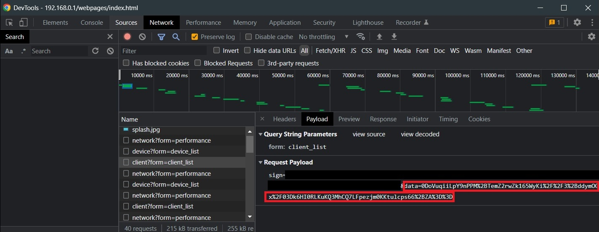

# Debugging

## General Steps

Check that:

1. TP-Link Deco integration is the latest published version
2. TP-Link Deco router firmware is up to date
3. Enable debug logging in `configuration.yaml` by adding these lines:

```yaml
logger:
  logs:
    custom_components.tplink_deco: debug
```

## Additional Debugging

If the debug logs show that a call is failing because of one of the following reasons:

- Error response from router
- Timed out

Follow the below steps to check that the router is behaving as expected.

1. Disable the TPLink Deco integration if it is enabled (If it is enabled it will keep logging you out)
2. Enable the browser developer console
3. Login to the admin UI page
4. Go to the page with the failing call (Example: Go to page that lists clients if the list clients call is failing)
5. Find the call that is failing in the developer console network tab.
   - Example login calls:
     - http://192.168.0.1/cgi-bin/luci/;stok=/login?form=keys
     - http://192.168.0.1/cgi-bin/luci/;stok=/login?form=auth
     - http://192.168.0.1/cgi-bin/luci/;stok=/login?form=login
   - Example list deco call:
     - http://192.168.0.1/cgi-bin/luci/;stok=0123456789abcdef/admin/device?form=device_list
   - Example list client call:
     - http://192.168.0.1/cgi-bin/luci/;stok=0123456789abcdef/admin/client?form=client_list
6. Find the request payload `data=` param and copy the part right after `data=`
   
7. In the developer console type the following code:

```js
data = "<insert the copied code here>";
jQuery.encrypt.encryptManager.encryptor.AesDecrypt(decodeURIComponent(data));
```

8. Copy the output of the command and paste it in the bug.
9. If the call was successful but the parsing on the integration failed. Please also find the response value after `"data": ` and decode it in the same way as step 7.
10. Add the response to the bug, redact any personal info.
